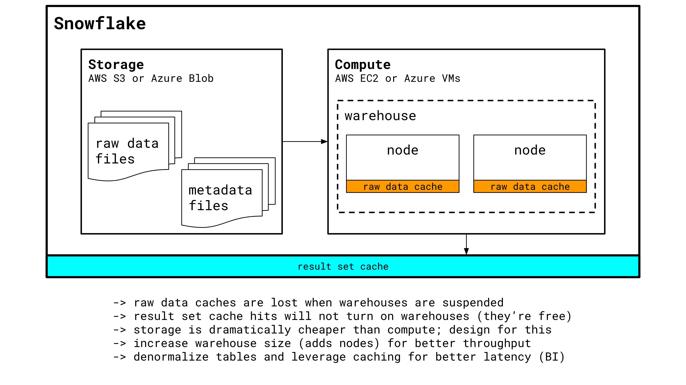

# Meetup 1 | May 22, 2019
Welcome to our first meetup!

By now, you should have access to a Snowflake instance and should be able to run queries. If not, sign up at https://www.snowflake.com/

## Part 1 -- Snowflake Concepts
Before we dive in to the Snowflake web UI, let's take a moment to discuss how Snowflake works behind the scenes. Below is a very simplified (and not 100% accurate) summary of the major components of Snowflake:

Knowing the basics of this diagram will give you a head start in building an intuition around why we do the things the way we do in Snowflake.

### Setup
First, let's build our basic Snowflake environment. Start by opening the [`setup.sql`](sql/setup.sql) file in the [`sql`](sql) directory and pasting its contents into a fresh worksheet in the Snowflake web UI. We'll run these queries now.

### Warmup Queries
Now let's execute some warmup queries in [`warmupQueries.sql`](sql/warmupQueries.sql). Copy the contents of that file and paste it into a new worksheet in the Snowflake web UI.

We'll run through the queries together and come back here for part 2.

## Part 2 -- Uploading Custom Data
The best thing you can learn today is how to get data into Snowflake with nothing but the web UI and a trusty CSV file.

This is a common first step for people interested in justifying larger, automated Snowflake ingestion projects. Getting comfortable with taking database extracts or results from python scripts and turning them into queryable Snowflake tables is a foundational skill.

### Download Raw Data
Next, look through the different raw data sources in the [`raw_data`](raw_data) directory. We have the following options (with links to the Kaggle dataset they come from):

- [`bob_ross.csv`](raw_data/bob_ross.csv) | https://www.kaggle.com/fivethirtyeight/fivethirtyeight-bob-ross-dataset
- [`amazon_food_reviews.csv`](raw_data/amazon_food_reviews.csv) | https://www.kaggle.com/snap/amazon-fine-food-reviews

Pick your favorite datasource and start downloading the csv file.

### Create the Table
In the [`sql`](sql) directory, find the sql file containing table creation statements for the data source you chose in the previous step. Copy the contents of this file now.

We'll paste the contents of the sql file into a fresh worksheet in the Snowflake Web UI. Make sure you take care to run all statements in the file or you may mess up your permissions structure.

### Upload Data
With a table existing for your csv data, we'll now use the Snowflake web UI's CSV uploading tool to import data directly in the web browser.

Rather than write out the instructions for you, I'm going to insist we look at the Snowflake docs for how to upload our data. Getting comfortable with referencing the fantastic Snowflake docs now will save you hours of pain and heartache in the future.

Open the following link and follow the instructions: https://docs.snowflake.net/manuals/user-guide/data-load-web-ui.html

